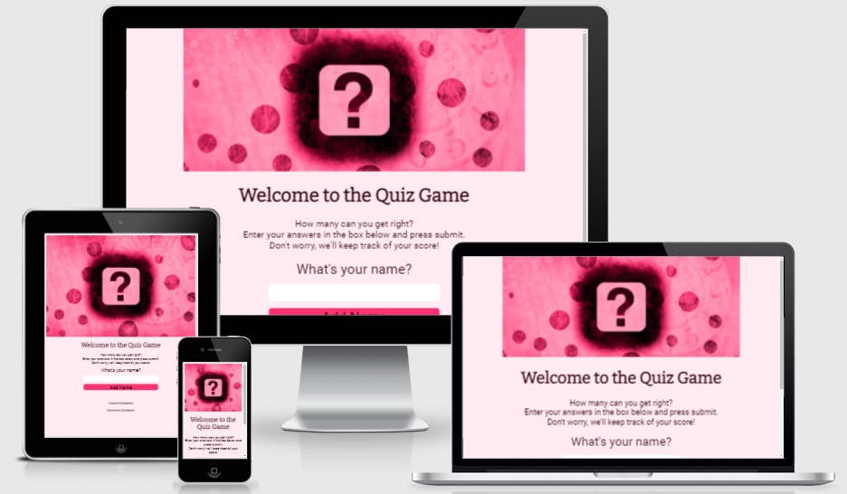
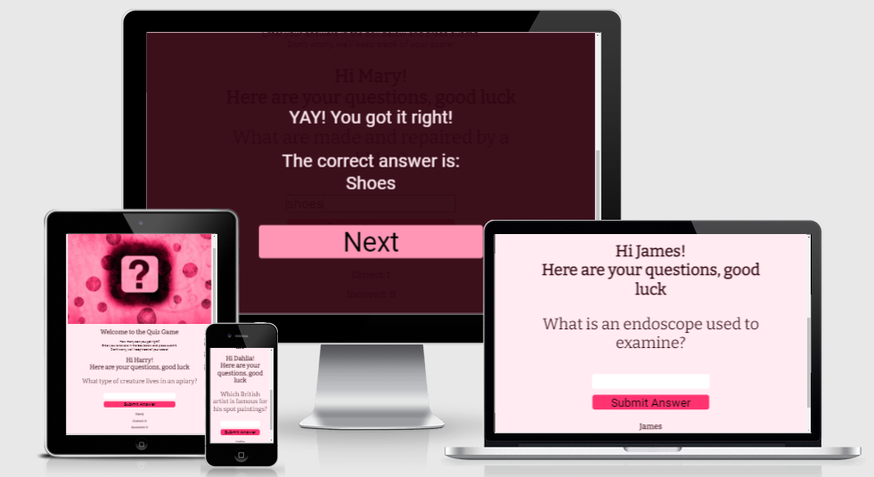
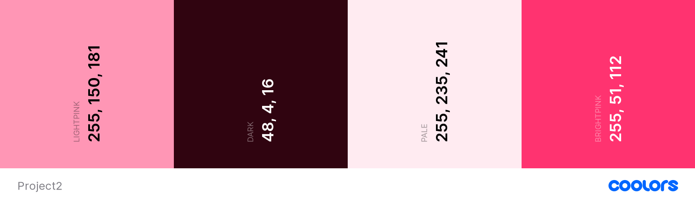

# A Quiz Game

Portfolio Project 2 JavaScript Essentials - Code Institute

## About

This Quiz Game is designed to act as a randomised quiz for people who love easy levelled trivia. There was an uptake in quizzing at the beginning of the COVID-19 pandemic and these are the level of questions enjoyed in homes all over the country. 

# User Experience

## Strategy

Reasons a user may visit a site:

- A user wants to practise easy levelled trivia and test how many they get right

- A user may want to play the quiz game with a friend

Reasons for the site:

- Little trivia quiz to pass the time

## Scope

A user can expect: 
    
  - A single paged site
  - Responsive design for screen sizes maintaining legibility of features
  - Randomised questions for a different order each visit
  - A scoreboard to keep track of the number of correct answers
  - A screen that tells them the correct answer
  - A message to celebrate or commiserate with the user
  - Interactive features over buttons and a responsive feedback
  - A personalised experience with a username of their choice

## Structure

The website will consist of one page with distinct areas.

1. A hero image welcoming them to the site
2. An introduction to what the site is for
3. An opportunity to enter a username with submission button.
3. A question is asked
4. An answer box with submission button.
6. Upon triggering the submit button, the screen will be overlayed with a celebration or commiseration screen and a next button to return to the main screen for the next question
7. A scoreboard area at the base of the page for keeping track of the score

## Surface

### Colours

- In the CSS, 4 variable colours have been created: dark, pale, lightpink, brightpink.
- Dark, #300410 has been used rather than black for most of the site to aid user experience, especially for those who are low vision users. It is a colour picked out from the hero image in order to have a consistent theme. It is used either as text or a background colour for the best contrast. 
- Pale, #FFEBF1 has been used for text contrast on strong background colours for better contrast, limiting eye strain and allowing for a better user experience.
- Pale has also been used as a background for the main body of the site. This aids contrast with the dark text but also maintains a minimalistic site allowing the text information to be the main focus for the user. 
- Brightpink has been selected from the hero image using the colour picker tool. This has been used as an accent colour for buttons
- Lightpink has been selected from the hero image using the colour picker tool. This has been used as an accent colour for buttons.

Under some colour blindness types, the two pinks (either side of the image) look quite similar however as they are used as accents and never placed directly atop one another, it does not affect the use of the colours or user experience: there is no need for contrast between the two pink colours (Brightpink and Lightpink). 

The colour picker used was in chrome dev tools.

The colour palette image was produced using coolors.co.

### Typography

I have used https://fonts.google.com/ for my fonts. Using Bitter for the headings and Roboto for body text and sans-serif as back up. These are classic, easily legible fonts.
To achieve this, I imported the following to the top of my style.css file.

    @import url('https://fonts.googleapis.com/css2?family=Bitter&family=Roboto&display=swap');

### Imagery
The hero image for this site was found from [pixabay](https://pixabay.com/illustrations/question-mark-question-why-5633947/) and is open access free for commercial use with no attribution required. It is of a question mark as that is a common association with quizzes: asking questions.

## Features

### Existing Features

- Hero image of a question mark for the 'quizzy' theme and for a friendly welcoming with a colour scheme in keeping with it

- Can add personal name: 
  - entering your name is optional, it is possible to press "Add Name" without entering something as some people may uncomfortable entering one. 
  - the "Add Name" button has a hover effect so the user can tell they are hovered over it by the changing of colour and cursor. 
  - user can press enter instead of clicking
  - upon pressing "Add Name" the option input area is removed and replaced with a personalised message. The name is also used in the scoreboard area at the bottom of the page
  
- Can enter answer in any case

- All buttons have a hover effect of changing colour from Brightpink to Lightpink as well as a cursor change. 

- A scoreboard to keep track of correct and incorrect answers

- The questions are in a random order and so each visit will be a slightly different experience

- Upon pressing "next" the cursor is focussed in the answer box

- From a coder experience, the variables at the beginning of the CSS make it easy to change colour scheme. It is also easy to update the quiz questions as they are read in from a csv rather than written out in the script.js file. 

- A celebration or commiseration overlay that is only visible upon submission of the answer and disappears when the next button is pressed. If incorrect, it also displays to the user what their submission was and always shows what the actual answer is. 

### Features Left to Implement
- The ability to add more than one user: much of the object set up was orientated around this task. I recognise that there are different ways to implement for a sole user which would have made the code simpler.

- Multiple choice: in retrospect it is difficult to get the right answer due to the complexity of multiple words and punctuation as well as poor spelling. 

- A hint feature using a lightbulb image which will then give a hint for the answer.

- Ability to press enter on the "answer message" screen as to not need to use the mouse: less of an issue for touchscreen users.

- Avoid repeat questions in a session

## Testing

### Personal Testing
- Used lighthouse testing:
  - desktop 100% performance, accessibility, best practices however 89% SEO due to lack of meta description
  - mobile 99% performance, 100% accessibility and best practices, 91% SEO. 
- Carried out the following successfully
  - Checked a username can be entered using enter key
  - Checked a username can be entered using the mouse
  - Checked the correct username is then used in greeting message and scoreboard
  - Checked that the submit answer button triggers the answer message overlay
  - Checked that the answer being correct or incorrect is true
  - Checked correct answers affect the "correct" part of the scoreboard
  - Checked incorrect answers affect the "incorrect" part of the scoreboard
  - Checked a random question is triggered each time - this may lead to repeats due to the nature of random.
  - Checked clicking "next" will remove the celebration/commiseration overlay
  - Checked clicking "next" provides a new random question
  - Checked clicking "next" refocuses the cursor into the answer box automatically
  - Checked the hover effects over the buttons work correctly
  - Checked responsiveness using devtools whatismyscreenresolution
  - Checked colour blindness using coolors.co to ensure all text is legible
  - Checked answers can be in any case (upper/lower/mixture) and still be accepted if correct

### Validator Testing
- HTML
  - No errors when passed through the [W3C Validator](https://validator.w3.org/nu/?doc=https%3A%2F%2Fmmoore483.github.io%2Fquiz%2F)
  - There are two warnings relating to the use of section elements without heading elements
- CSS
  - Errors in the CSS validator are due to the use of variables with rgb. This was done to allow colours to be declared at the top of the CSS file and be used throughout whilst maintaining one central area to change the theme. The opacity requirement was for aesthetic and researched using other coder's experienced. Despite that, they do technically count as errors. This was carried out using the [jigsaw validator](https://jigsaw.w3.org/css-validator/validator?uri=https%3A%2F%2Fmmoore483.github.io%2Fquiz%2F&profile=css3svg&usermedium=all&warning=1&vextwarning=&lang=en)
- JS
  - Used [JShint](https://jshint.com/) with no major warnings

### Unfixed Bugs

- The user could see the correct answer in the dev tools html code should they choose to
- The CSS Validator did not like the use of rgb colours as variables - look into an alternative way of carrying this out. 

# Deployment

- The site was deployed to GitHub pages. The steps to deploy are as follows: 
  - In the GitHub repository, navigate to the Settings tab 
  - Navigate down the sidebar to the Pages tab
  - From the Source section drop-down menu, select the Master Branch
  - Then press save, the page will be automatically refreshed with a detailed ribbon display to indicate the successful deployment. 

The live link can be found here - https://mmoore483.github.io/quiz/

When changes are made to the site using GitHub, the git push command will automatically update the deployed site.

## Forking

To trial changes to the site without affecting the original, the GitHub Repository can be forked.

- Log into GitHub and locate the desired repository
- In the top right, click the Fork button.

## Cloning

[Cloning](https://docs.github.com/en/github/creating-cloning-and-archiving-repositories/cloning-a-repository-from-github/cloning-a-repository) is useful for a multitude of reasons: to contribute to a project, to trial changes, to fix merge conflicts, add or remove files, and push larger commits.

- Log into your GitHub then find the gitpod repository
- Click the Code button
- If cloning with HTTPS, click the clipboard icon to copy the link
- Open Gitbash
- Change the current working directory to the location where you want the cloned directory to be.
- Type git clone, and then paste the URL you copied earlier.
- Press enter to create your local clone

# Credits

- Quiz questions from https://www.funquizzes.uk/easy-quiz-questions/
- Responsiveness tested using [whatismyscreenresolution](http://whatismyscreenresolution.net/multi-screen-test)
- Testing site for colour accessibility and creating colour palette image: coolors.co 
- The imported fonts are from googlefonts 
- W3C HTML Validator for testing validity of HTML
- Jigsaw CSS Validator for testing validity of CSS
- JShint Validator for testing validity of JS
- Matt Rudge for the Code Institute Master Template
- Pixabay for [question mark image](https://pixabay.com/illustrations/question-mark-question-why-5633947/)
- Information on global variable creation for colours was from [W3Schools](https://www.w3schools.com/css/css3_variables.asp)
- The Coding Train [tutorial 1.1](https://www.youtube.com/watch?v=tc8DU14qX6I&t=0s&ab_channel=TheCodingTrain) and [tutorial 1.2](https://www.youtube.com/watch?v=RfMkdvN-23o&ab_channel=TheCodingTrain)
- The Code Institute [Love Maths Walkthrough](https://github.com/Code-Institute-Solutions/love-maths-2.0-sourcecode) for logic behind aspects of the game and general inspiration
- Steve Griffith (Prof3ssorSt3v3) for YouTube tutorial for [saving using inputs in JS objects](https://www.youtube.com/watch?v=NxVCq4p0Kb0&ab_channel=SteveGriffith-Prof3ssorSt3v3)
- [stackoverflow forum](https://stackoverflow.com/questions/40010597/how-do-i-apply-opacity-to-a-css-color-variable) for information on rgba colours and variables
- Images of site at the beginning of this README were created using [ami.responsivedesign](http://ami.responsivedesign.is/#)

